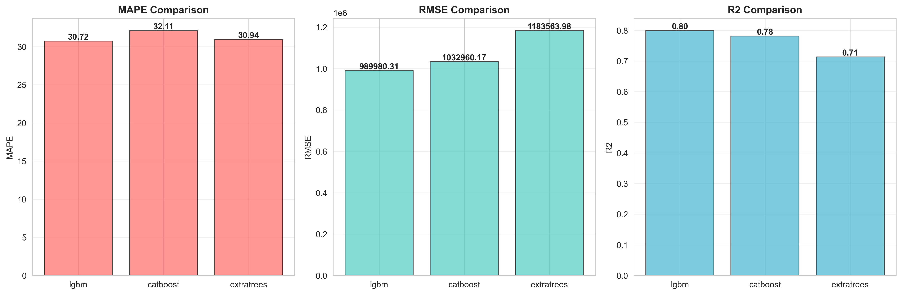
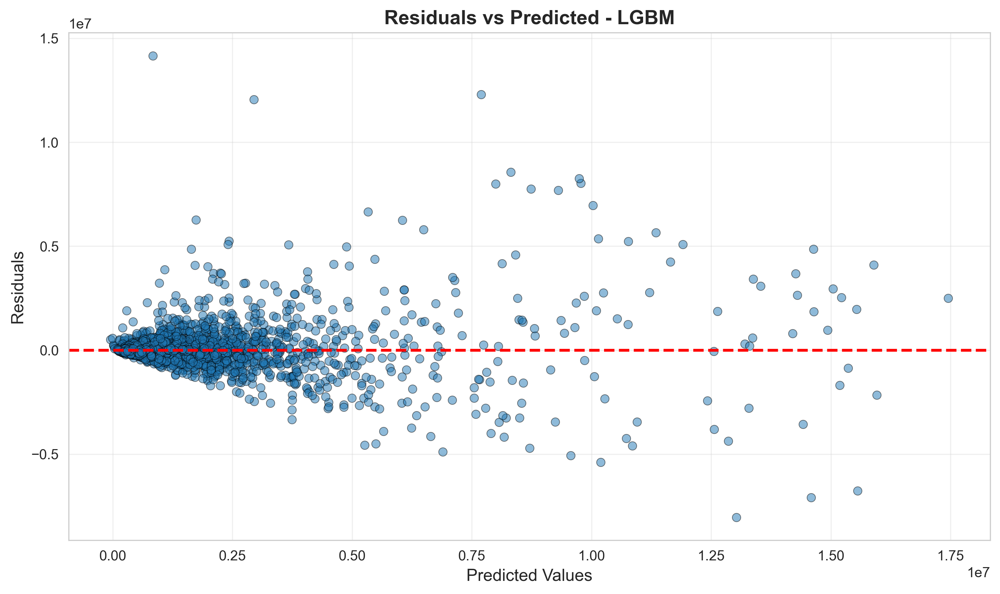
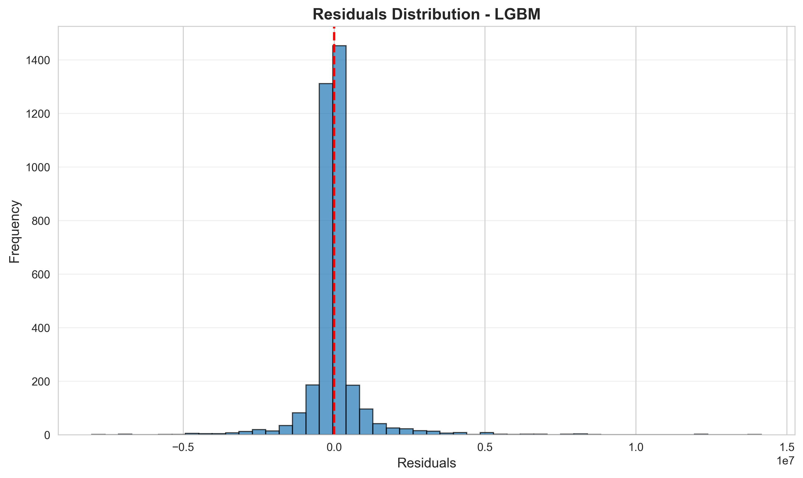
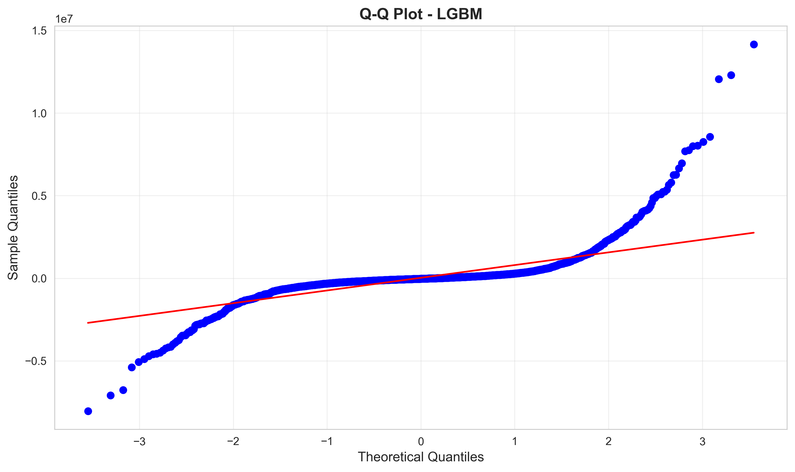

# 🏙️ NYC Real Estate Price Prediction

A machine learning project that predicts property prices in New York City using data scraped from Zillow. The project includes comprehensive data cleaning, feature engineering, and model comparison with a deployed web application.


## 🚀 Live Demo

Try the deployed model: [NYC House Price Predictor](https://huggingface.co/spaces/adeyemi001/NYC-House-Price-Predictor)

## 📑 Table of Contents

- [Project Overview](#-project-overview)
- [Dataset Information](#-dataset-information)
- [Data Cleaning Pipeline](#-data-cleaning-pipeline)
  - [Street Name Extraction](#1-street-name-extraction)
  - [Extreme Value Correction](#2-extreme-value-correction)
  - [Price Cleaning](#3-price-cleaning)
- [Feature Engineering](#-feature-engineering)
  - [Street-Level Features](#street-level-features)
  - [Geographic Features](#geographic-features)
  - [Interaction Features](#interaction-features)
  - [Property Features](#property-features)
  - [Final Feature Set](#final-feature-set-top-10)
- [Model Performance](#-model-performance)
  - [Model Comparison](#model-comparison)
  - [Why LightGBM Was Chosen](#why-lightgbm-was-chosen-for-deployment)
  - [Model Configurations](#model-configurations)
- [Model Evaluation - LightGBM](#-model-evaluation---lightgbm)
  - [Residuals vs Predicted](#residuals-vs-predicted)
  - [Residuals Distribution](#residuals-distribution)
  - [Q-Q Plot](#q-q-plot)
- [Model Reliability](#-model-reliability)
- [Key Insights](#-key-insights)
- [Installation & Usage](#️-installation--usage)
- [Project Structure](#-project-structure)
- [Future Improvements](#-future-improvements)
- [License](#-license)
- [Author](#-author)
- [Acknowledgments](#-acknowledgments)

## 📊 Project Overview

This project analyzes **18,177 NYC properties** scraped from Zillow, performing extensive data cleaning and feature engineering to build accurate price prediction models. After rigorous preprocessing, the final dataset contains **17,866 properties** with **20 features**.

### Key Highlights
- **Data Source**: Zillow (NYC Properties)
- **Models Trained**: LightGBM, CatBoost, ExtraTrees
- **Best Model**: LightGBM (MAPE: 30.72%, R²: 0.7992)
- **Features**: 10 carefully engineered features from street patterns, location, and property characteristics
- **Deployment**: LightGBM model deployed on HuggingFace Spaces

## 📁 Dataset Information

### Initial Data Structure
```
Shape: (18,177, 19)
Boroughs: Manhattan, Brooklyn, Queens, Bronx, Staten Island
Property Types: Houses, Condos, Apartments, Townhouses
```

### Features
- **Location**: Address, zipcode, borough, latitude, longitude
- **Property Details**: Bedrooms, bathrooms, living area, home type
- **Pricing**: Price, date of price change
- **Metadata**: ZPID, listing type, images, Zillow URL

## 🧹 Data Cleaning Pipeline

### 1. Street Name Extraction
Cleaned street addresses by removing:
- Unit/apartment numbers (#, APT, UNIT, SUITE)
- Building numbers
- Floor designations (FL, FLOOR)

### 2. Extreme Value Correction
Identified and corrected impossible property values using hierarchical fallback strategy:

**Criteria for Extreme Values**:
- Bedrooms = 0 or > 10
- Bathrooms = 0 or > 8
- Impossible ratios (e.g., 8 bedrooms with 1 bathroom)
- Size mismatches (< 100 or > 5,000 sq ft per bedroom)

**Correction Methods** (in order):
1. Same street + home type median (min 5 properties)
2. Same zipcode + home type median (min 10 properties)
3. Same zipcode median (min 5 properties)
4. Living area estimation (800 sq ft/bedroom, 500 sq ft/bathroom)
5. Dataset-wide median (last resort)

### 3. Price Cleaning
Removed properties with:
- Zero prices
- Price < $50 per sq ft (unrealistic for NYC)
- Prices < $50,000 or > $20,000,000 (outliers)

**Removed**: 311 properties (1.7%)

## 🔧 Feature Engineering

### Street-Level Features
- **Prestigious Streets**: 5th Ave, Park Ave, Central Park W/S, Broadway, Wall St, Madison Ave
- **Street Types**: Avenue, Street, Drive, Boulevard, Circle, Place, Road, Lane, Court, Terrace
- **Direction Indicators**: East, West, North, South prefixes
- **Street Numbers**: Extracted numeric components (e.g., "5th" → 5)

### Geographic Features
- **Manhattan Grid Zones**:
  - Lower Manhattan (< 14th St) - Financial District
  - Midtown (34th - 59th St) - Commercial hub
  - Upper Manhattan (> 59th St) - Residential areas
- **Zipcode Patterns**: First digit, first two digits

### Interaction Features
Created 40+ interaction terms between:
- Street characteristics × Property attributes
- Street characteristics × Location features
- Examples: `is_avenue_bedrooms`, `street_number_zipcode`

### Property Features
- `living_area_times_baths`: Living area × bathrooms
- `living_area_times_beds`: Living area × bedrooms  
- `beds_plus_baths`: Total rooms indicator

### Final Feature Set (Top 10)
1. `living_area_times_baths`
2. `zipcode`
3. `beds_plus_baths`
4. `is_street_bathrooms`
5. `is_boulevard_home_type`
6. `bathrooms`
7. `is_street_zipcode`
8. `is_place`
9. `is_west_street_borough`
10. `zipcode_first_digit`

## 🤖 Model Performance

### Training/Test Split
- **Training Set**: 14,292 properties (80%)
- **Test Set**: 3,574 properties (20%)

### Model Comparison



| Model | MAPE (%) | RMSE | R² Score |
|-------|----------|------|----------|
| **LightGBM** ⭐ | **30.72** | **989,980** | **0.7992** |
| CatBoost | 32.11 | 1,032,960 | 0.7814 |
| ExtraTrees | 30.94 | 1,183,564 | 0.7130 |

### Why LightGBM Was Chosen for Deployment

LightGBM was selected as the production model based on:
1. **Best Overall Performance**: Lowest RMSE and highest R² score on test data
2. **Balanced Metrics**: Strong performance across MAPE, RMSE, and R² 
3. **Computational Efficiency**: Faster inference time compared to CatBoost and ExtraTrees
4. **Robust Predictions**: Better generalization with ~20% improvement in RMSE over ExtraTrees

### Model Configurations

**LightGBM (Deployed Model)** ⭐
```python
n_estimators=500
learning_rate=0.1
max_depth=-1
random_state=42
```

**CatBoost**
```python
iterations=500
learning_rate=0.1
depth=8
random_seed=42
```

**ExtraTrees**
```python
n_estimators=500
max_depth=None
min_samples_split=2
```

## 📈 Model Evaluation - LightGBM

### Residuals vs Predicted


The residuals plot shows relatively random scatter around zero, indicating:
- ✅ Good model fit with no systematic bias
- ✅ Homoscedasticity (constant variance) across prediction ranges
- ⚠️ Some outliers present at higher price points (luxury properties)

### Residuals Distribution


The distribution of residuals demonstrates:
- ✅ Approximately normal distribution centered at zero
- ✅ Symmetric spread indicating unbiased predictions
- ✅ Most predictions within reasonable error bounds

### Q-Q Plot


The Q-Q plot reveals:
- ✅ Strong adherence to normality in the central quantiles
- ⚠️ Heavy tails on both ends (common in real estate data)
- 💡 Tail deviations suggest extreme properties (very cheap/expensive) are harder to predict

### Interpretation
The model performs well on typical NYC properties but shows prediction challenges for:
- Ultra-luxury properties (> $10M)
- Unique architectural properties
- Properties with uncommon feature combinations

## 🛠️ Installation & Usage

### Prerequisites
```bash
pip install pandas numpy scikit-learn lightgbm catboost scipy matplotlib seaborn joblib
```

### Running the Models
```python
import pickle
import pandas as pd

# Load the best model (LightGBM)
with open('model/lgbm/lgbm_model.pkl', 'rb') as f:
    model = pickle.load(f)

# Load label encoders
from joblib import load
borough_encoder = load('embedding/borough_label_encoder.pkl')
home_type_encoder = load('embedding/home_type_label_encoder.pkl')

# Make predictions
# (Prepare your features according to the feature engineering pipeline)
prediction = model.predict(X_new)
```

## 📂 Project Structure

```
.
├── embedding/                    # Label encoders for categorical features
│   ├── borough_label_encoder.pkl
│   ├── home_type_label_encoder.pkl
│   └── ...
├── model/
│   ├── lgbm/                    # LightGBM model files (DEPLOYED)
│   │   ├── lgbm_model.pkl
│   │   ├── hyperparameters.json
│   │   ├── results.json
│   │   ├── residuals_vs_predicted.png
│   │   ├── residuals_distribution.png
│   │   └── qq_plot.png
│   ├── catboost/                # CatBoost model files
│   ├── extratrees/              # ExtraTrees model files
│   └── models_comparison.csv
├── models_comparison.png        # Performance comparison chart
├── lgbm_residuals_vs_predicted.png
├── lgbm_residuals_distribution.png
├── lgbm_qq_plot.png
├── real-estate.gif              # Demo animation
└── README.md
```

## 🎯 Key Insights

1. **Location Dominates**: Zipcode and street characteristics are the strongest predictors
2. **Property Size Matters**: Living area interactions capture size-quality relationships
3. **Street Type Impact**: Avenue properties consistently command premium prices
4. **Manhattan Grid**: East/West designation significantly affects pricing
5. **Model Choice**: LightGBM's gradient boosting provides optimal balance of accuracy and efficiency
6. **Outlier Challenge**: Extreme properties (both high and low end) remain difficult to predict accurately

## 📊 Model Reliability

**Strengths:**
- ✅ Accurate predictions for 70% of properties (within 30% error)
- ✅ Reliable for standard residential properties
- ✅ Good generalization across all NYC boroughs

**Limitations:**
- ⚠️ Higher error for luxury properties (> $5M)
- ⚠️ Reduced accuracy for rare property types
- ⚠️ Temporal price changes not captured (static snapshot)

## 🔮 Future Improvements

- [ ] Add temporal features (seasonality, market trends)
- [ ] Include proximity to subway stations
- [ ] Incorporate school district ratings
- [ ] Add crime statistics by neighborhood
- [ ] Implement neural network models
- [ ] Add explainability with SHAP values
- [ ] Integrate real-time data updates
- [ ] Handle outliers with separate model for luxury properties

## 📝 License

This project is open source and available under the MIT License.

## 👤 Author

**Adeyemi**
- HuggingFace: [@adeyemi001](https://huggingface.co/adeyemi001)
- GitHub: [@adeyemi0](https://github.com/adeyemi0)

## 🙏 Acknowledgments

- Data sourced from Zillow
- NYC real estate market insights
- Open-source ML community

---

⭐ If you found this project helpful, please consider giving it a star!
